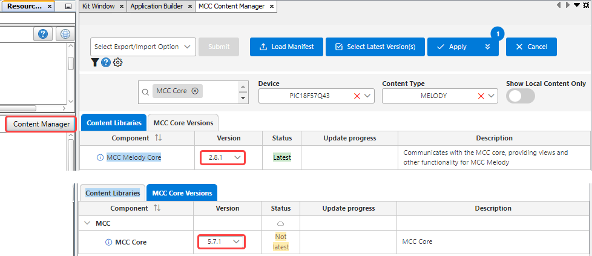
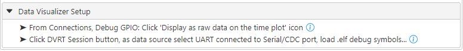
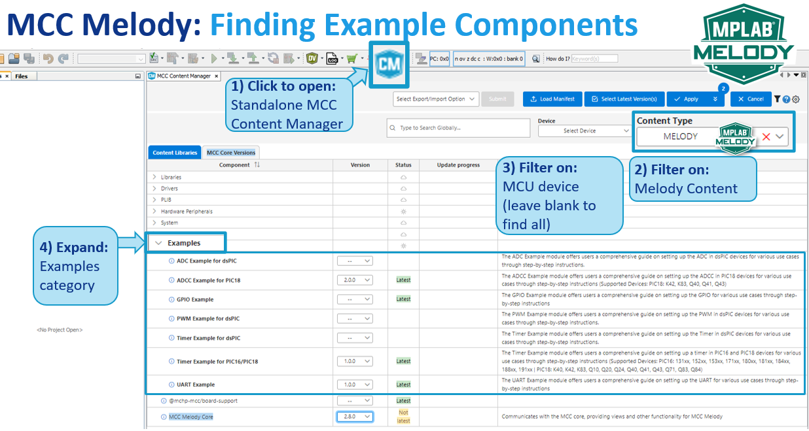

<!-- MPAE-19445 Please do not change this logo with link -->

<a target="_blank" href="https://www.microchip.com/" id="top-of-page">
   <picture>
      <source media="(prefers-color-scheme: light)" srcset="images/mchp_logo_light.png" width="350">
      <source media="(prefers-color-scheme: dark)" srcset="images/mchp_logo_dark.png" width="350">
      
   </picture>
</a>

# AVR128DB48 I2C_Host Example Component for CNano Explorer: I2C Proximity Sensor (Callbacks, Data Streamer)

The [I2C Proximity Sensor example](https://onlinedocs.microchip.com/v2/keyword-lookup?keyword=I2C.HOST.EX.RUNNING.I2C.HOST.PROXIMITY.SENSOR&version=latest&redirect=true "I2C Proximity Sensor example"
), of the [MCC Melody I2C Example Component (for the Curiosity Nano Explorer)](https://onlinedocs.microchip.com/v2/keyword-lookup?keyword=I2C.HOST.EXAMPLE.COMPONENT&version=latest&redirect=true "MCC Melody I2C Example Component for the Curiosity Nano Explorer"
), is used here in the Polled implementation, with the Data Streamer visualization. 

This example demonstrates how to read the value of the VCNL4200 proximity sensor on the Curiosity Nano Explorer, with the DV Run Time Visualization Output selected. Every 100 ms, an LED and a Debug I/O pin are toggled. Depending on the DVRT streaming tick setting (default is 100 ms), the appropriately formatted values of the variables added to the DVRT Streaming Table are sent to the [MPLAB® Data Visualizer](https://www.microchip.com/en-us/tools-resources/debug/mplab-data-visualizer "MPLAB® Data Visualizer").  

The below image of the MPLAB Data Visualizer shows the application running, where proximityValue and framecount have been added to the DVRT Streaming Table and Time Plot: 

The following is a block diagram view of the application, as seen in the [MCC Melody Builder](https://onlinedocs.microchip.com/v2/keyword-lookup?keyword=MCC.MELODY.BUILDER&version=latest&redirect=true "MCC Melody Builder"). 

## MCC Melody Example Components
Example Components are a tight integration of learning material directly into MCC. This allows users to conveniently place the configuration instructions side-by-side to the components they are configuring. For more information, refer to the [MCC Melody Example Components](https://onlinedocs.microchip.com/v2/keyword-lookup?keyword=MCC.MELODY.EXAMPLES&version=latest&redirect=true) introduction. 

## Related Documentation

- [MCC Melody I2C Example Component (for the Curiosity Nano Explorer)](https://onlinedocs.microchip.com/v2/keyword-lookup?keyword=I2C.HOST.EXAMPLE.COMPONENT&version=latest&redirect=true "MCC Melody I2C Example Component for the Curiosity Nano Explorer")
- [MCC Melody Design Patterns for Control Flow](https://onlinedocs.microchip.com/v2/keyword-lookup?keyword=I2C.HOST.EXAMPLE.COMPONENT&version=latest&redirect=true "MCC Melody I2C Example Component for the Curiosity Nano Explorer")

- [Curiosity Nano Explorer User Guide](https://ww1.microchip.com/downloads/aemDocuments/documents/MCU08/ProductDocuments/UserGuides/PIC18F57Q43-Curiosity-Nano-HW-UserGuide-DS40002186B.pdf "Curiosity Nano Explorer Users Guide")

- [PIC18F57Q43 Data Sheet](https://ww1.microchip.com/downloads/aemDocuments/documents/MCU08/ProductDocuments/DataSheets/PIC18F27-47-57Q43-Data-Sheet-40002147F.pdf "PIC18F57Q43 Data Sheet")

## Software Used
- MPLAB® X IDE 6.25.0 or newer [(MPLAB® X IDE 6.25.0)](https://www.microchip.com/en-us/development-tools-tools-and-software/mplab-x-ide)
- MPLAB® XC8 3.00.0 or newer [(MPLAB® XC8 3.00.0)](https://www.microchip.com/en-us/tools-resources/develop/mplab-xc-compilers/xc8)

- MPLAB® Code Configurator (MCC) Plug-in Version 5.5.2 or newer (*Tools>Plugins>Installed*, search: "MCC")
- MPLAB Data Visualizer Plug-in Version 1.4.1926 or newer (*Tools>Plugins>Installed*, search: "Data Visualizer")
- MCC Melody I2C_Host Example Component for the Curiosity Nano Explorer 1.0.0 or newer
- MCC Core 5.7.1 or newer 
- MCC Melody Core 2.8.1 or newer

Open the MCC Content Manager to verify the MCC Core and MCC Melody Core versions. 

## Hardware Used
- PIC18F57Q43 Curiosity Nano [(DM164150)](https://www.microchip.com/en-us/development-tool/DM164150)
- Curiosity Nano Explorer [(EV58G97A)](https://www.microchip.com/en-us/development-tool/EV58G97A)

## Setup

The following outlines the complete MCC Melody configuration, including all the selected tasks that have been implemented in this example.

[Data Visualizer Setup](https://onlinedocs.microchip.com/v2/keyword-lookup?keyword=I2C.HOST.DATA.VISUALIZER.SETUP&version=latest&redirect=true) 

To run the example, follow the steps in the Data Visualizer Setup section: 

- [Data Visualizer Debug GPIO Setup](https://onlinedocs.microchip.com/v2/keyword-lookup?keyword=I2C.HOST.EX.DV.DEBUG.IO&version=latest&redirect=true)
- [Data Visualizer Setup for DV Run Time](https://onlinedocs.microchip.com/v2/keyword-lookup?keyword=I2C.HOST.EX.DVRUNTIME.CONFIG&version=latest&redirect=true) 

## Summary
For more example components, follow these steps: 

1) Open the stand-alone Content Manager  in MPLAB X IDE. 
2) Filter on Melody content.
3) Filter on MCU device (optional, leave blank to find all).
4) Expand Examples category under Content Libraries. 

 
